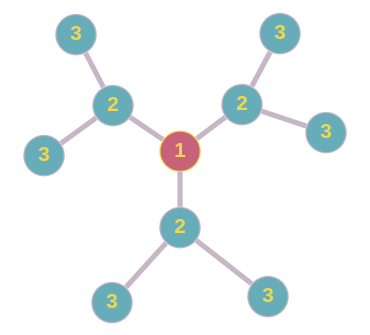
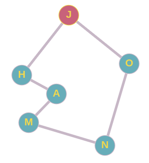

## Why Can Breadth-First Search Find the Shortest Path?

Breadth-First Search (BFS) can be used to find the shortest path in an unweighted graph -- that is, a graph with equal-length edges. The BFS shortest path algorithm has been successfully implemented in this project. If the graph were weighted, BFS could not accomplish the task.

In level-order traversal of a graph, the vertices are explored in layers. That is, vertices are visited in "all directions at once", or more accurately put, one level at a time:

There could be multiple routes to a vertex like below. If `J` is the starting point, and `N` is the goal, then the path on the right is the shortest path:

And in breadth-first search, `N` is arrived at via the shortest route before the longer path has a chance to be fully explored.

But if *depth*-first search were attempted, then the entire left path might be traversed first, and then we couldn't just immediately trace back the path to `J` and get the shortest path as we could in breadth-first traversal.

So in summary, BFS is used to find the shortest path in an unweighted graph. DFS, however, might traverse a longer path to a vertex and find that vertex without trying a shorter path first. The goal of our algorithm is to trace back the path as soon as the vertex is found.